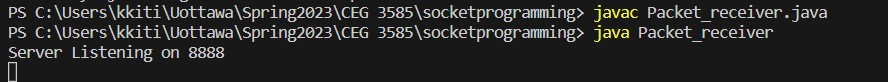
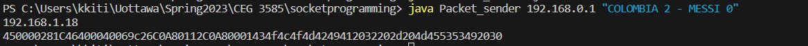
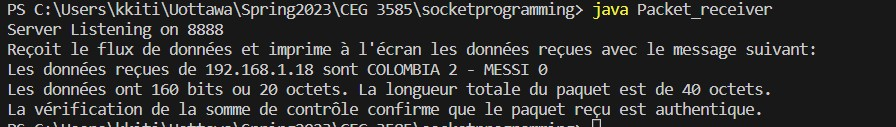
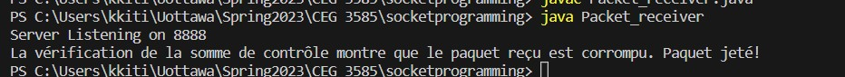

# IP-Datagram-encoding
Allows the encoding and decoding of an IP datagram following IPv4 datagram format

## How to run?
Open terminal:
- javac Packet_receiver.java
- java Packet_receiver

Open a new terminal:
- javac Packet_sender.java
- java Packet_sender 192.168.0.1 "MESSAGE"

## How to check for corrupted bits?

Uncomment line 58 in Packet_receiver.java and rerun

## Additional Information
Screenshots of the running code is provided:

### Server listening on port

### Raw datagram sent

### Received message at server side

### Corrupted header behavior

